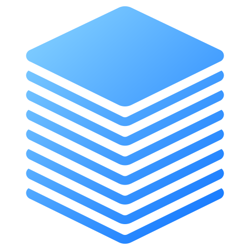

# FoggyBalrog.Collections <!-- omit from toc -->

A .NET library providing collection types not found in the BCL, focused on data structures for graph algorithms.

> [!WARNING]
> **Early development.** The API is unstable and may change between versions. Not recommended for production use.

- [Summary](#summary)
- [Contributing](#contributing)
- [License](#license)
- [Credits](#credits)

## Summary

| Collection | Description |
|---|---|
| `AddressablePriorityQueue<TKey, TPriority>` | Priority queue where priorities can be updated. |
| `CircularBuffer<T>` | Fixed-capacity ring buffer with configurable full-buffer behavior. |
| `DisjointSet<T>` | Union-find data structure. |

## Contributing

If you find a bug or have a suggestion, open an issue before submitting a pull request.

## License

This project is licensed under the [MIT License](./LICENSE.txt).

## Credits

Icon created by [meaicon on Flaticon](https://www.flaticon.com/authors/meaicon).